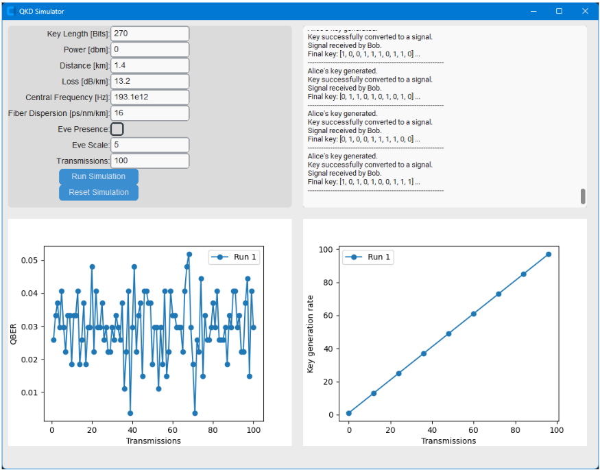

# COW-QKD Simulator: COW Protocol

In this simulation scenario, we explore **COW-QKD**, a method that uses continuous variables like quantum states of light to achieve secure key distribution between Alice and Bob. 

The following image illustrates the graphical UI of the QKD Simulator for the COW protocol.

## UI Overview
- **Top Left:** Parameters (degrees of freedom) for the simulation
- **Top Right:** Information for every transmission
- **Bottom Left:** Plot of QBER (Quantum Bit Error Rate) achieved vs. transmissions
- **Bottom Right:** Generated key vs. transmissions

## Simulation Parameters
You can customize the simulation using the following degrees of freedom:

- **Key Length:** The length of the random bit string Alice creates and transmits.
- **Power:** The power emitted in the optical fiber of the quantum signal.
- **Distance:** The length of the optical fiber between Alice and Bob.
- **Loss:** The quantum signal loss over the optical fiber during the transmission.
- **Central Frequency:** The central frequency selected for the transmission.
- **Fiber Dispersion:** The fiber’s optical dispersion.
- **Eve Presence:** The existence of an eavesdropper in the quantum channel.
- **Eve Scale:** Controls how aggressively the eavesdropper tries to gain information from the quantum signal.
- **Transmissions:** The number of transmissions during the simulation.

---
## Download the Docker Project

You can download the full Docker project from this repository.

[Download docker image from OneDrive](https://innocubeike-my.sharepoint.com/:f:/g/personal/trevlakis_innocube_org/Em3qYlLoEM9GtTd8KN8HdtgBLEIStXRUdmhHcy-LNakv2A?e=gW3Ne6)
---